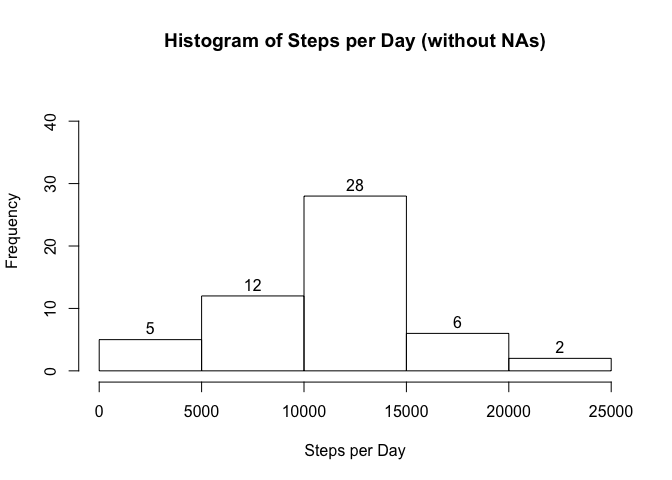
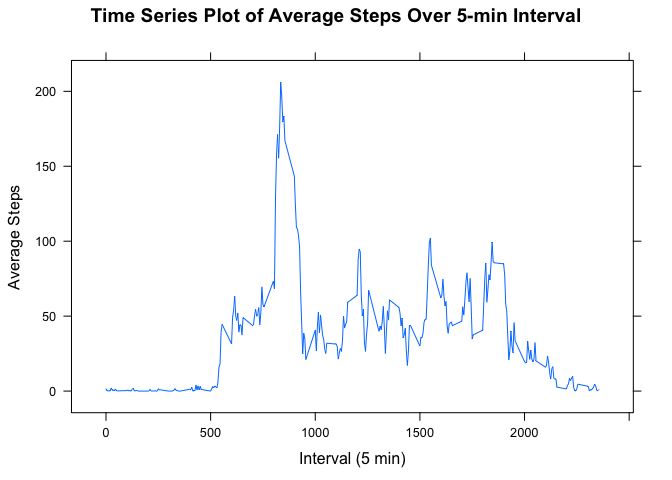
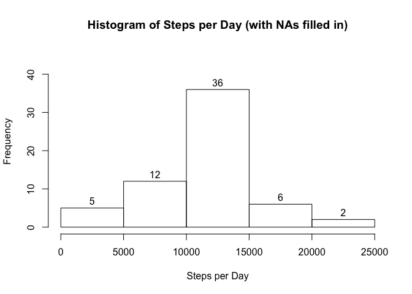
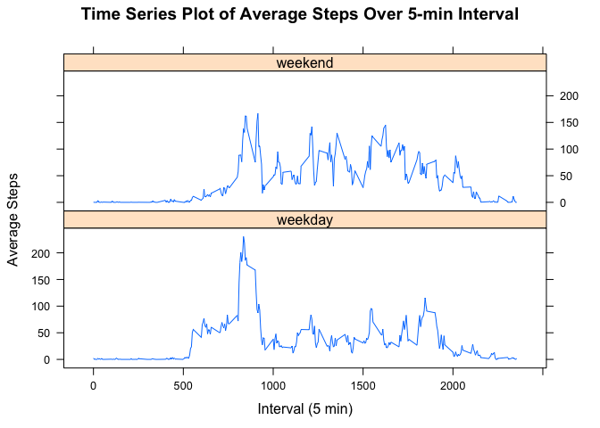

# Reproducible Research: Peer Assessment 1


## Loading and preprocessing the data
1. Load the data (i.e. read.csv())

```r
##set working directory
setwd("/Users/hgmoen/Documents/Data Science/5-Reproducible_Research")
##read csv
act_all<-read.csv("activity.csv")
```

2. Process/transform the data (if necessary) into a format suitable for your analysis

```r
##remove NAs
act<-na.omit(act_all)
act_all$date<-as.Date(act_all$date)
```

## What is mean total number of steps taken per day?
1. Calculate the total number of steps taken per day

```r
steps_sum<-aggregate(act$steps, by=list(act$date), sum, na.rm=TRUE)
colnames(steps_sum)<-c("Date", "Steps")
library(xtable)
sum<-xtable(steps_sum)
print(sum, type="html")
```

<!-- html table generated in R 3.1.2 by xtable 1.7-4 package -->
<!-- Fri May 15 08:47:32 2015 -->
<table border=1>
<tr> <th>  </th> <th> Date </th> <th> Steps </th>  </tr>
  <tr> <td align="right"> 1 </td> <td> 2012-10-02 </td> <td align="right"> 126 </td> </tr>
  <tr> <td align="right"> 2 </td> <td> 2012-10-03 </td> <td align="right"> 11352 </td> </tr>
  <tr> <td align="right"> 3 </td> <td> 2012-10-04 </td> <td align="right"> 12116 </td> </tr>
  <tr> <td align="right"> 4 </td> <td> 2012-10-05 </td> <td align="right"> 13294 </td> </tr>
  <tr> <td align="right"> 5 </td> <td> 2012-10-06 </td> <td align="right"> 15420 </td> </tr>
  <tr> <td align="right"> 6 </td> <td> 2012-10-07 </td> <td align="right"> 11015 </td> </tr>
  <tr> <td align="right"> 7 </td> <td> 2012-10-09 </td> <td align="right"> 12811 </td> </tr>
  <tr> <td align="right"> 8 </td> <td> 2012-10-10 </td> <td align="right"> 9900 </td> </tr>
  <tr> <td align="right"> 9 </td> <td> 2012-10-11 </td> <td align="right"> 10304 </td> </tr>
  <tr> <td align="right"> 10 </td> <td> 2012-10-12 </td> <td align="right"> 17382 </td> </tr>
  <tr> <td align="right"> 11 </td> <td> 2012-10-13 </td> <td align="right"> 12426 </td> </tr>
  <tr> <td align="right"> 12 </td> <td> 2012-10-14 </td> <td align="right"> 15098 </td> </tr>
  <tr> <td align="right"> 13 </td> <td> 2012-10-15 </td> <td align="right"> 10139 </td> </tr>
  <tr> <td align="right"> 14 </td> <td> 2012-10-16 </td> <td align="right"> 15084 </td> </tr>
  <tr> <td align="right"> 15 </td> <td> 2012-10-17 </td> <td align="right"> 13452 </td> </tr>
  <tr> <td align="right"> 16 </td> <td> 2012-10-18 </td> <td align="right"> 10056 </td> </tr>
  <tr> <td align="right"> 17 </td> <td> 2012-10-19 </td> <td align="right"> 11829 </td> </tr>
  <tr> <td align="right"> 18 </td> <td> 2012-10-20 </td> <td align="right"> 10395 </td> </tr>
  <tr> <td align="right"> 19 </td> <td> 2012-10-21 </td> <td align="right"> 8821 </td> </tr>
  <tr> <td align="right"> 20 </td> <td> 2012-10-22 </td> <td align="right"> 13460 </td> </tr>
  <tr> <td align="right"> 21 </td> <td> 2012-10-23 </td> <td align="right"> 8918 </td> </tr>
  <tr> <td align="right"> 22 </td> <td> 2012-10-24 </td> <td align="right"> 8355 </td> </tr>
  <tr> <td align="right"> 23 </td> <td> 2012-10-25 </td> <td align="right"> 2492 </td> </tr>
  <tr> <td align="right"> 24 </td> <td> 2012-10-26 </td> <td align="right"> 6778 </td> </tr>
  <tr> <td align="right"> 25 </td> <td> 2012-10-27 </td> <td align="right"> 10119 </td> </tr>
  <tr> <td align="right"> 26 </td> <td> 2012-10-28 </td> <td align="right"> 11458 </td> </tr>
  <tr> <td align="right"> 27 </td> <td> 2012-10-29 </td> <td align="right"> 5018 </td> </tr>
  <tr> <td align="right"> 28 </td> <td> 2012-10-30 </td> <td align="right"> 9819 </td> </tr>
  <tr> <td align="right"> 29 </td> <td> 2012-10-31 </td> <td align="right"> 15414 </td> </tr>
  <tr> <td align="right"> 30 </td> <td> 2012-11-02 </td> <td align="right"> 10600 </td> </tr>
  <tr> <td align="right"> 31 </td> <td> 2012-11-03 </td> <td align="right"> 10571 </td> </tr>
  <tr> <td align="right"> 32 </td> <td> 2012-11-05 </td> <td align="right"> 10439 </td> </tr>
  <tr> <td align="right"> 33 </td> <td> 2012-11-06 </td> <td align="right"> 8334 </td> </tr>
  <tr> <td align="right"> 34 </td> <td> 2012-11-07 </td> <td align="right"> 12883 </td> </tr>
  <tr> <td align="right"> 35 </td> <td> 2012-11-08 </td> <td align="right"> 3219 </td> </tr>
  <tr> <td align="right"> 36 </td> <td> 2012-11-11 </td> <td align="right"> 12608 </td> </tr>
  <tr> <td align="right"> 37 </td> <td> 2012-11-12 </td> <td align="right"> 10765 </td> </tr>
  <tr> <td align="right"> 38 </td> <td> 2012-11-13 </td> <td align="right"> 7336 </td> </tr>
  <tr> <td align="right"> 39 </td> <td> 2012-11-15 </td> <td align="right">  41 </td> </tr>
  <tr> <td align="right"> 40 </td> <td> 2012-11-16 </td> <td align="right"> 5441 </td> </tr>
  <tr> <td align="right"> 41 </td> <td> 2012-11-17 </td> <td align="right"> 14339 </td> </tr>
  <tr> <td align="right"> 42 </td> <td> 2012-11-18 </td> <td align="right"> 15110 </td> </tr>
  <tr> <td align="right"> 43 </td> <td> 2012-11-19 </td> <td align="right"> 8841 </td> </tr>
  <tr> <td align="right"> 44 </td> <td> 2012-11-20 </td> <td align="right"> 4472 </td> </tr>
  <tr> <td align="right"> 45 </td> <td> 2012-11-21 </td> <td align="right"> 12787 </td> </tr>
  <tr> <td align="right"> 46 </td> <td> 2012-11-22 </td> <td align="right"> 20427 </td> </tr>
  <tr> <td align="right"> 47 </td> <td> 2012-11-23 </td> <td align="right"> 21194 </td> </tr>
  <tr> <td align="right"> 48 </td> <td> 2012-11-24 </td> <td align="right"> 14478 </td> </tr>
  <tr> <td align="right"> 49 </td> <td> 2012-11-25 </td> <td align="right"> 11834 </td> </tr>
  <tr> <td align="right"> 50 </td> <td> 2012-11-26 </td> <td align="right"> 11162 </td> </tr>
  <tr> <td align="right"> 51 </td> <td> 2012-11-27 </td> <td align="right"> 13646 </td> </tr>
  <tr> <td align="right"> 52 </td> <td> 2012-11-28 </td> <td align="right"> 10183 </td> </tr>
  <tr> <td align="right"> 53 </td> <td> 2012-11-29 </td> <td align="right"> 7047 </td> </tr>
   </table>

2. Make a histogram of the total number of steps taken each day

```r
hist(steps_sum$Steps, labels=TRUE, ylim=c(0,45), main="Histogram of Steps per Day (without NAs)", xlab="Steps per Day")
```

 

3. Calculate and report the mean and median of the total number of steps taken per day

```r
steps_mean<-aggregate(steps_sum$Steps, by=list(steps_sum$Date), mean, na.rm=TRUE)
options(scipen=999)
mean<-mean(steps_mean$x)
steps_med<-aggregate(steps_sum$Steps, by=list(steps_sum$Date), median, na.rm=TRUE)
med<-median(steps_med$x)
```
Mean of total number of steps taken per day: 10766.1886792   
Median of total number of steps taken per day: 10765

## What is the average daily activity pattern?
1. Make a time series plot (i.e. type = "l") of the 5-minute interval (x-axis) and the average number of steps taken, averaged across all days (y-axis)

```r
library("lattice")
mean_int<-aggregate(act$steps, by=list(act$interval), mean, na.rm=TRUE)
colnames(mean_int)<-c("interval", "average_steps")
xyplot(average_steps~interval, data=mean_int, type="l", main="Time Series Plot of Average Steps Over 5-min Interval", xlab="Interval (5 min)", ylab="Average Steps")
```

 

2. Which 5-minute interval, on average across all the days in the dataset, contains the maximum number of steps?

```r
maxrow<-which.max(mean_int$average_steps)
maxint<-mean_int[maxrow,]$interval
```
The 5-minute interval that contains the maximum number of steps is: 835

## Imputing missing values
1. Calculate and report the total number of missing values in the dataset (i.e. the total number of rows with NAs)

```r
nas<-sum(is.na(act_all))
```
The number of missing values in the data set is: 2304

2. Devise a strategy for filling in all of the missing values in the dataset. The strategy does not need to be sophisticated. For example, you could use the mean/median for that day, or the mean for that 5-minute interval, etc.  
3. Create a new dataset that is equal to the original dataset but with the missing data filled in.

```r
##replace all NA values with the mean for that 5-minute interval
na<-which(is.na(act_all)==TRUE)
act_replace<-act_all
for (i in na) {
        act_replace[i, "steps"]<-mean_int[which(mean_int$interval==act_replace[i,"interval"]),"average_steps"]
}
```

4. Make a histogram of the total number of steps taken each day and Calculate and report the mean and median total number of steps taken per day. Do these values differ from the estimates from the first part of the assignment? What is the impact of imputing missing data on the estimates of the total daily number of steps?


```r
new_steps_sum<-aggregate(act_replace$steps, by=list(act_replace$date), sum, na.rm=TRUE)
colnames(new_steps_sum)<-c("Date", "Steps")
hist(new_steps_sum$Steps, labels=TRUE, ylim=c(0,45), main="Histogram of Steps per Day (with NAs filled in)", xlab="Steps per Day")
```

 

```r
new_steps_mean<-aggregate(new_steps_sum$Steps, by=list(new_steps_sum$Date), mean, na.rm=TRUE)
options(scipen=999)
new_mean<-mean(new_steps_mean$x)
new_steps_med<-aggregate(new_steps_sum$Steps, by=list(new_steps_sum$Date), median, na.rm=TRUE)
new_med<-median(new_steps_med$x)
```
Mean:10766.1886792  
Median:10766.1886792  

The values differ from the estimates in the first part of the assignment. Inputing missing data increases the number of days where steps were between 10000 and 15000 by 8, from 28 to 36. Because the other histogram bars remained the same, this would suggest that there were 8 days where all step values were NA. There was not a significant change in the mean and median between the two data sets, but the second set where the NAs were filled in resulted in the same value for the mean and median. The first part of the assignment, the mean and median were off by about 1. 

## Are there differences in activity patterns between weekdays and weekends?  
1. Create a new factor variable in the dataset with two levels – “weekday” and “weekend” indicating whether a given date is a weekday or weekend day.  

```r
library(timeDate)
```

```
## 
## Attaching package: 'timeDate'
## 
## The following object is masked from 'package:xtable':
## 
##     align
```

```r
act_wd<-act_replace
wd<-isWeekday(act_wd$date)
act_wd$weekday<-wd
```
2. Make a panel plot containing a time series plot (i.e. type = "l") of the 5-minute interval (x-axis) and the average number of steps taken, averaged across all weekday days or weekend days (y-axis). See the README file in the GitHub repository to see an example of what this plot should look like using simulated data.

```r
mean_int_wd<-aggregate(act_wd$steps, list(act_wd$interval, act_wd$weekday), mean)
colnames(mean_int_wd)<-c("interval", "weekday", "average_steps")
mean_int_wd$weekday<-gsub("TRUE", "weekday", mean_int_wd$weekday)
mean_int_wd$weekday<-gsub("FALSE", "weekend", mean_int_wd$weekday)
xyplot(average_steps~interval|weekday, data=mean_int_wd, type="l", panel="panel.lines", layout=c(1,2), main="Time Series Plot of Average Steps Over 5-min Interval", xlab="Interval (5 min)", ylab="Average Steps")
```

 
